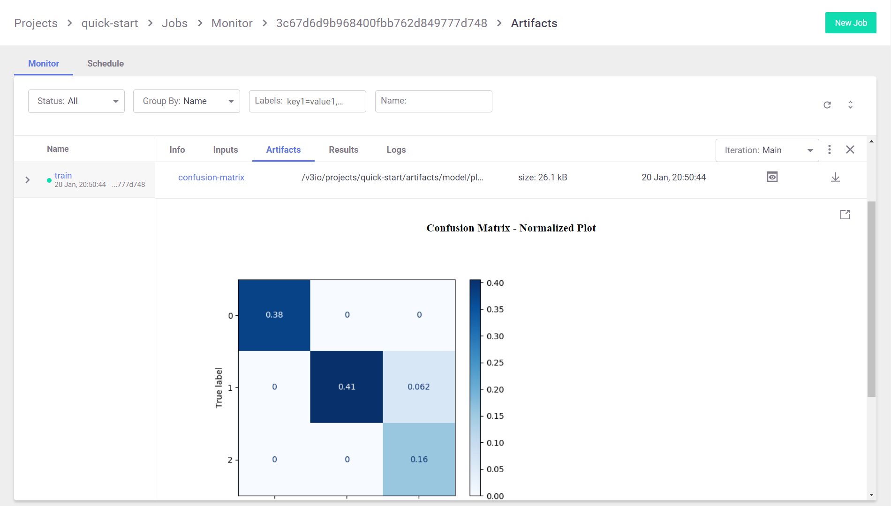

Function parameters are tracked and can be manipulated via the SDK/CLI.
Run the function again, this time pass the `format=parquet` arg:

`mlrun run -f gen-iris -p format=parquet --local`{{execute}}

You can see that this time the dataset is created in `parquet` format

> `-p` is used to specify parameters, see `mlrun run --help` for more flags

Results can be accessed via the CLI, SDK, or UI, click the next line:

`mlrun get run -p katacoda`{{execute}}

**Explore run progress, results and artifacts in the UI**

MLRun has a rich UI for tracking runs and artifacts:

> Note: The UI is usually installed on the k8s cluster or the managed MLRun service, it can also be installed as local docker image

