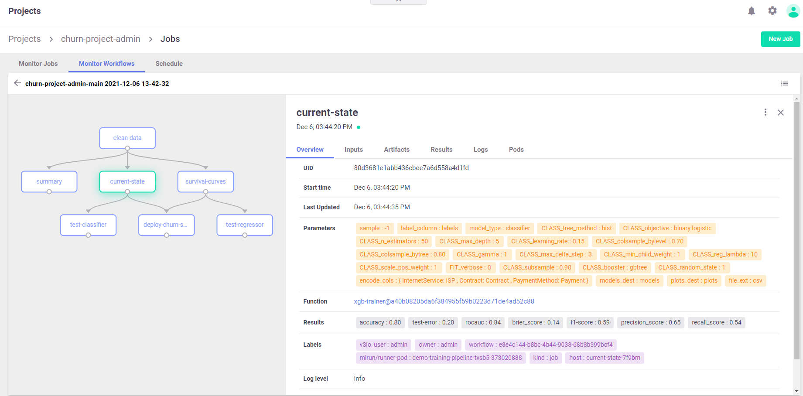

You can build automated ML pipelines composed of custom or [marketplace](https://www.mlrun.org/marketplace/functions/) functions. 
Pipelines can run on a cluster, be scheduled, run in CI/CD context, 
and/or be used to deploy services and models.

In the following example we run a 3 stage workflow:
- Run the data generator
- Train a model using the data from the generator
- Load and run a serving function from MLRun marketplace

> We run the serving function in simulation mode (mock) for now, since we are not connected to a real cluster

Read `simple_pipe()` code in `examples.py`{{open}}, and run the following:

`mlrun project -r examples.py -w --handler simple_pipe --local .`{{execute}}

> When we run a pipeline MLRun adds extra reporting, visualization, and notifications (e.g. to Slack, Git)

Visual Pipeline Run (in MLRun UI):

> In addition to batch pipelines, MLRun support Real-Time Pipelines for data processing, APIs, and serving, see: 
> [MLRun Real-time Serving Pipelines](https://docs.mlrun.org/en/latest/serving/serving-graph.html) docs.